# Lab 05 - Automation in copilot with Power Automate cloud flows

## What are connectors?

Connectors from Microsoft Power Automate are a proxy or "wrapper" around an API that allows the underlying service to talk to Microsoft Power Automate, Microsoft Power Apps, and Azure Logic Apps. Connectors let you connect your accounts and use a set of prebuilt actions and triggers to build your apps and workflows.

With connectors you can access various services (both within the Microsoft ecosystem and outside it) to perform a wide array of tasks automatically.

There are many connectors available, ranging from connections between and to Microsoft services like Office 365, SharePoint, and Dynamics 365, all the way to connections to third-party services like Twitter, Google services, Salesforce, and more. 

These connectors are categorized as:
- **Standard Connectors**  which are available in most Power Automate plans
- **Premium Connectors** which require specific Power Automate plans
- **Custom Connectors** which let you connect to any publicly available API for services not covered by existing connectors

## How do connectors work with Microsoft Copilot Studio?

Microsoft Power Automate connectors help extend the functionality of Microsoft Copilot Studio, enabling them to perform a wide range of tasks by connecting with various external services and applications. This integration empowers copilot makers to create more dynamic, responsive, and useful copilots, tailored to specific business needs and processes.

You can use connectors that already exist in your Power Apps environment or create a flow from the Microsoft Copilot Studio authoring canvas and call copilot-ready connectors from copilot topics as a discrete Call an action node.

In this lab, you will learn how to do the following:
* [5.1 Creating a Power Automate cloud flow for copilot](#51-creating-a-power-automate-cloud-flow-for-copilot)

## 5.1 Creating a Power Automate cloud flow for copilot

In this part of the lab you’ll learn how to add some additional logic and automation. 

A question will be added to the authoring canvas asking the user if they want to send the learning resources list to a channel in Microsoft Teams for members of the channel to review.

Should the user select Yes, a Power Automate cloud flow will be executed to send a Microsoft Teams message to your manager where the message content includes the prompt response from the plugin action.

1.	Click on the **X** icon to close **Test copilot** to increase the width of the authoring canvas.

    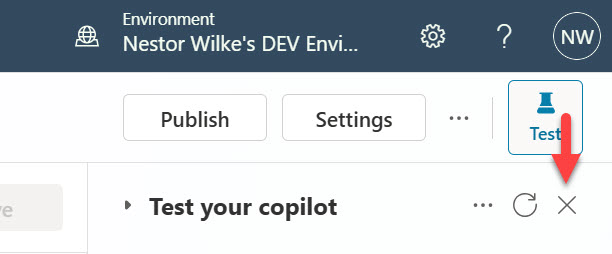

1.	Select the **+** icon in the authoring canvas to add a new node. This time select **Ask a question**.

    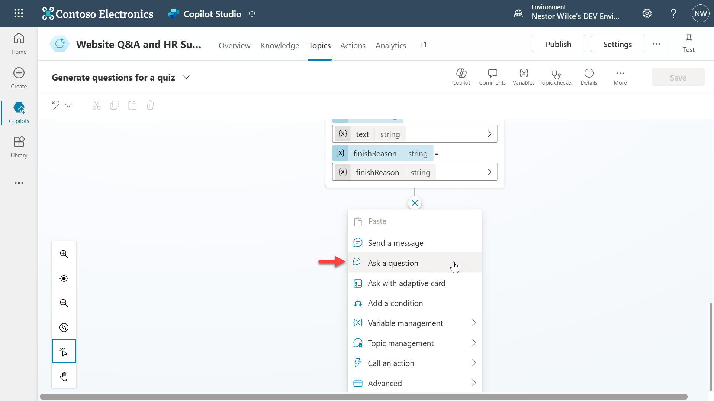

1.	Enter a question such as, 

    ```
    Do you want me to post a message to the General channel in the Contoso Microsoft Teams Group asking the channel members to review the compiled learning resources?
    ```
    
    

1. Select **+ New option** to add the options of **Yes**, **No**. Next select **Var**1** in the **Save user response as** field

    

1.	Update the name to **VarSendMessage**

    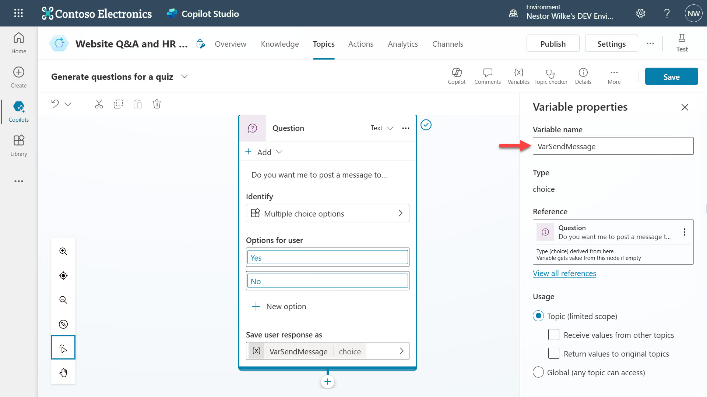

1.	Scroll down in the authoring canvas and under the **Condition** where the **VarSendMessage is equal to Yes**, select the **+** icon in the authoring canvas to add a new node. This time select **Call an action** and select **Create a cloud flow**

    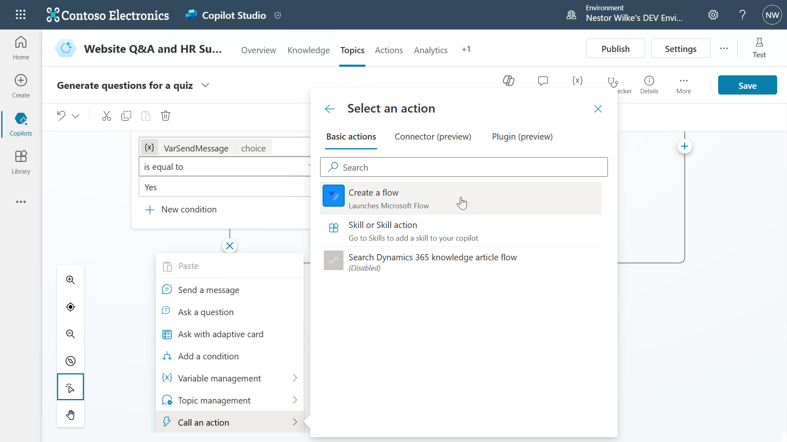

1.	Enter a name for the cloud flow such as, 

    ```
    Send Teams message to manager with prompt response
    ```
    

1.	Next, an input value needs to be added to the trigger. The value will be passed from the copilot to the cloud flow. Select **Text**. Enter `text generated` as the name of the input and select the **<** icon to collapse the trigger editing pane.

    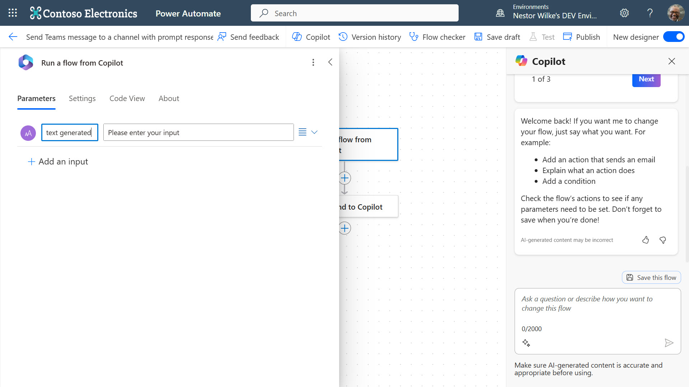

1.	Select the **+** icon on the cloud flow designer canvas and enter **Post a message in a chat or channel** to search for the Microsoft Teams action. Select the action.

    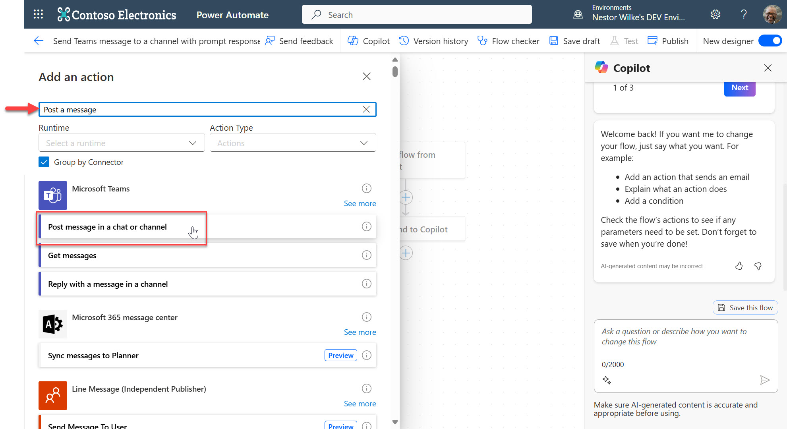

1.  Create a connection for the Teams connector by selecting sign in and sign in using your credentials.

    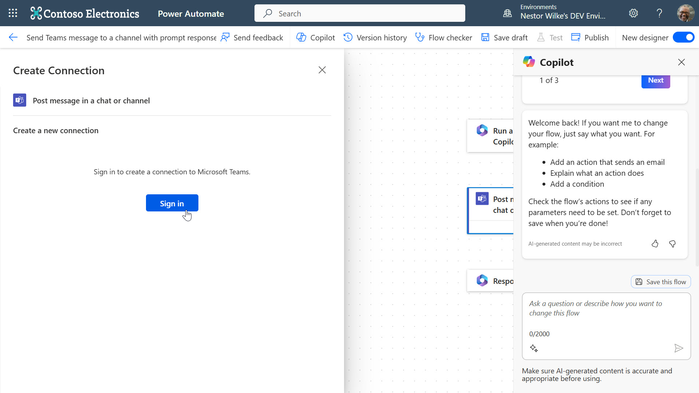

1.	Select the following in the input parameter fields,
    | Field | Value | Note |
    | --- | --- | --- |
    | Post As | Flow bot | |
    | Post In | Channel | |
    | Team | Contoso | |
    | Channel | General | |
    | Message | [Content of your choice] | Enter a description message for the users in the Teams channel and select the **thunder** icon to insert the text generated output from the trigger of the cloud flow into the message content.|

    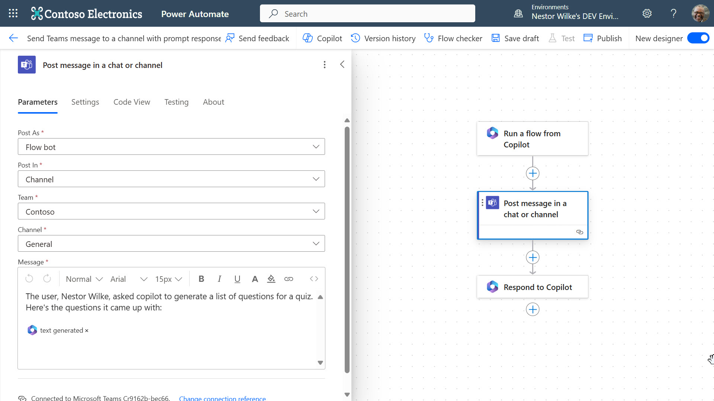

1.	To complete the end user experience, the cloud flow can send a link to the posted Teams message to the user in copilot as a response. Select the last action in the cloud flows, **Return value(s) to Power Virtual Agents** and select **+ Add an output**. 

    

1.	Select **text** as type of output, enter message link as the name of the output. In the value field, select the **thunder** icon and select the **Message Link** output from the **Post message in a chat or channel action**.

    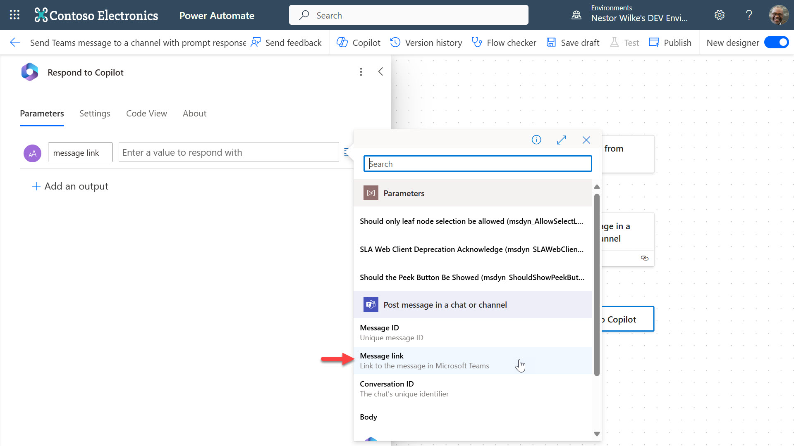

1.	The output value is now updated with the **Message Link** output from the **Post message in a chat or channel action**. Select **Save draft** on the top right hand side of the cloud flow designer.

    

1.	Wait until you receive the confirmation message that the cloud flow has been saved. Next select Publish.

    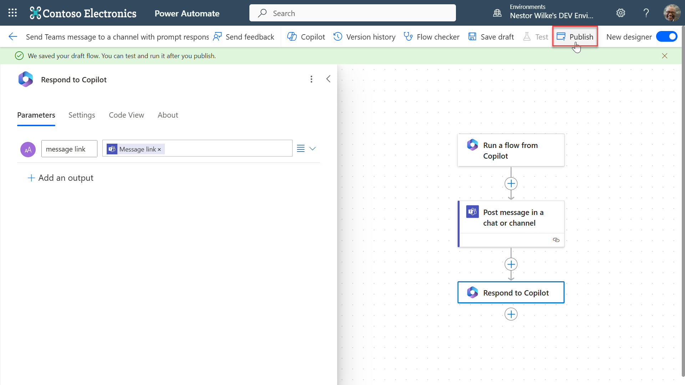

1.	Wait until you receive the confirmation message that the cloud flow has been saved. Next select Publish.

    

1.	Navigate back to the browser tab with Microsoft Copilot Studio and select **Done**.

    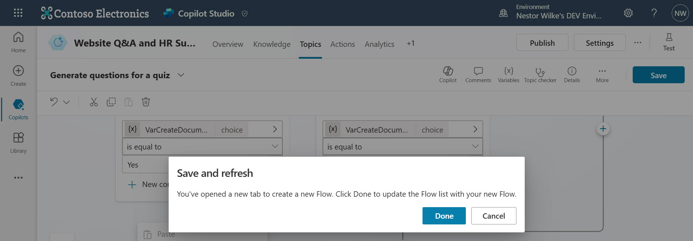

1. The cloud flow will now appear. Select the cloud flow.

    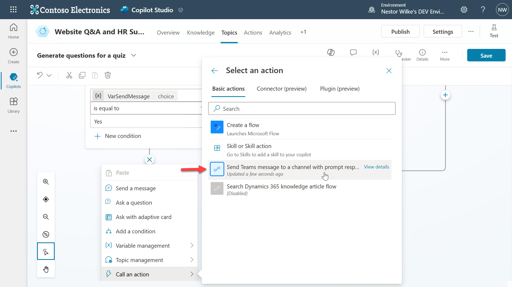

1.	In the Power Automate action node, select the **>** icon for the input and select **text**.

    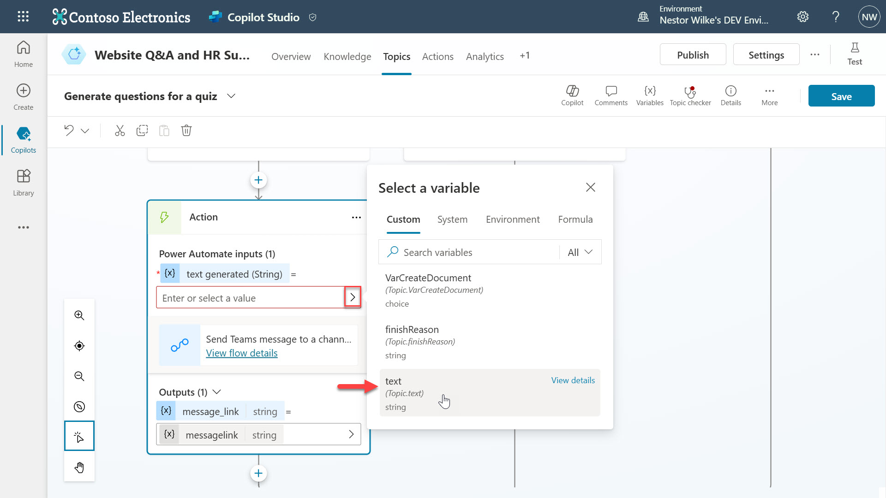

1.	Select the **+** icon in the authoring canvas to add a new node. This time select **Send a message**

    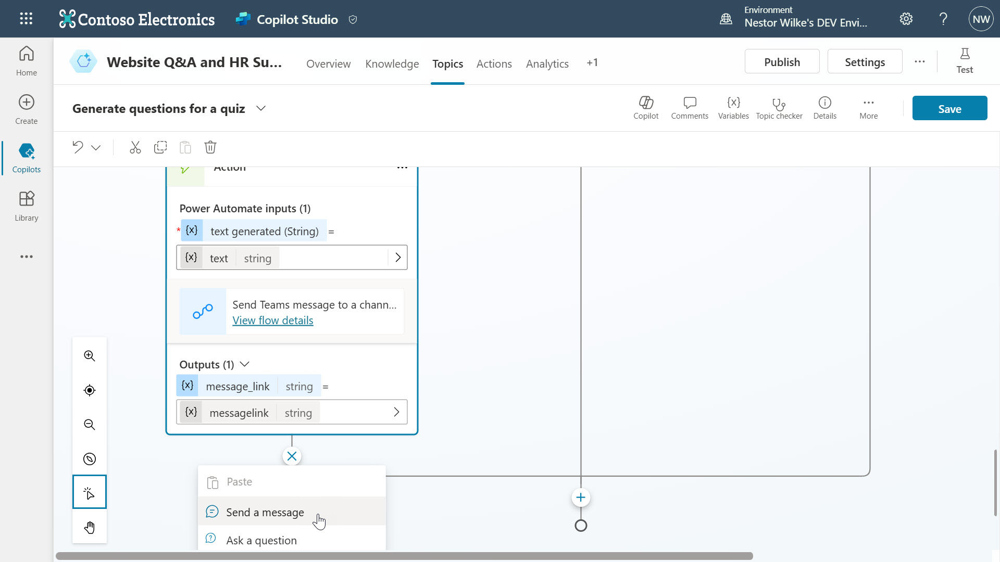

1.	Enter a message and then select the **{x}** icon and in the **Custom tab** select **messagelink**

    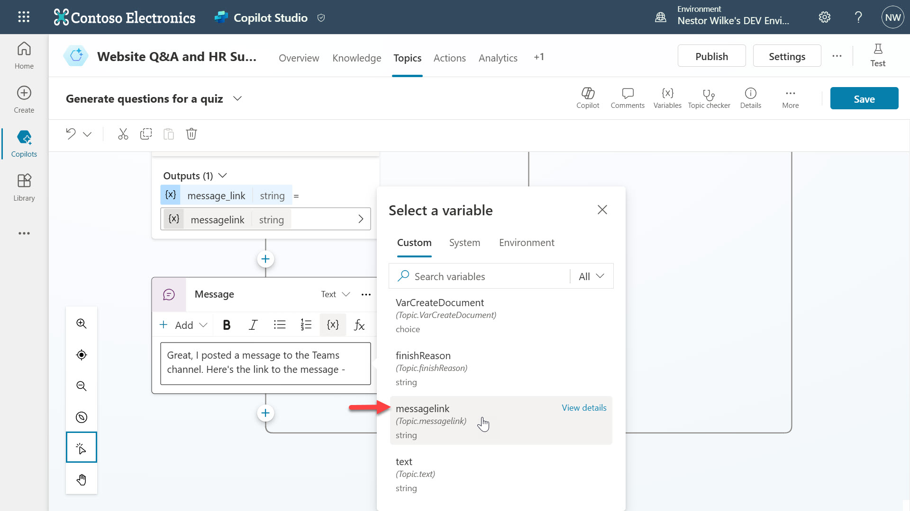

1.	Select **Save** on the top right hand side of the authoring canvas.

    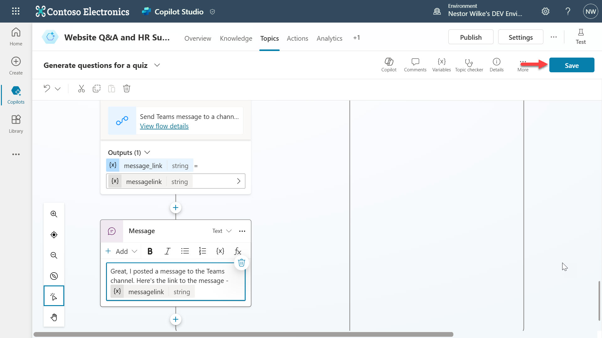

1.	Select the **refresh** button in the chat user interface, enter the following prompt and submit. 

    ```
    Create 5 questions for a quiz based on geography and format the quiz as multi choice
    ```

    

1.  Copilot will return a response and you’ll now see a message with a question including two options for you to select. Select **Yes**

    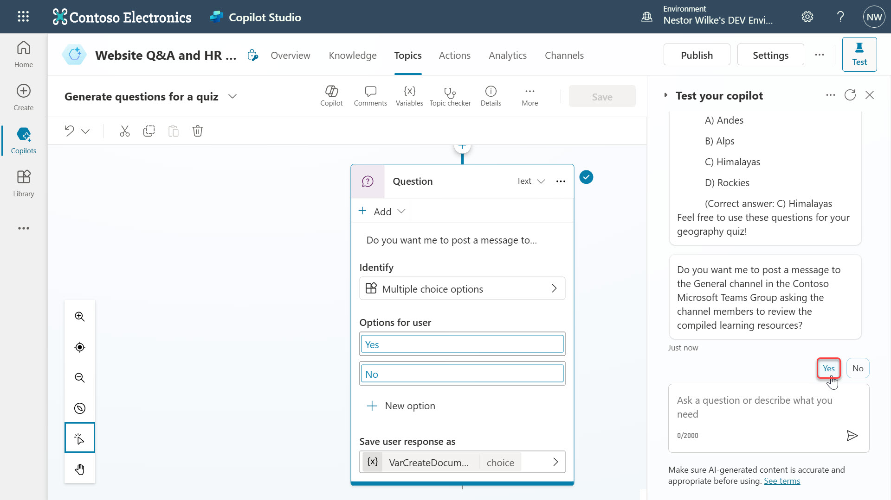

1.	Copilot will execute the Power Automate cloud flow node which results in the cloud flow being triggered and performing the action of posting a message to the General channel in Microsoft Teams where the content includes the prompt response. Copilot will then send a message back to the user which contains a link to view the message posted in the Teams channel. 

    

1. Click on the link and open Microsoft Teams in the app. The posted Teams message created from the cloud flow will appear.

    

> [!NOTE]  
> The message in Microsoft Teams will look unformatted. Microsoft Teams uses markdown or HTML for formatting and this is not covered in this workshop.

## End of lab and workshop

Congratulations! 🎇 You’ve now learnt how to create a Power Automate cloud flow to perform automation where the prompt plugin response is included in a message posted to a Microsoft Teams channel.

You’ve now reached the end of this lab and workshop 🎉
